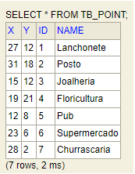

<p align="center" width="100%">
     
</p>


<h3 align="center">
  Desafio Backend do Backend Brasil
</h3>

<p align="center">

  
  
  

</p>

Resolução do desafio proposto pelo repositório Backend Brasil, confira detalhes [neste link](https://github.com/backend-br/desafios/blob/master/points-of-interest/PROBLEM.md).


# Sumário

+ [1 - Tecnologias utilizadas](#tecnologias-utilizadas)
+ [2 - Entenda o desafio](#entenda-o-desafio)
+ [3 - Como interagir com o banco de dados?](#como-interagir-com-o-banco-de-dados)
+ [4 - Como interagir com a API?](#como-interagir-com-a-api)
+ [5 - Desenvolvimento](#desenvolvimento)
+ [6 - Construção](#construção)
+ [7 - Contribuições](#contribuições)
+ [8 - Links](#links)
+ [9 - Exemplos de Uso](#exemplos)


## Tecnologias utilizadas

* Java 21
* Spring Boot
* Spring Data JPA
* H2 - Database
* Lombok
* DevTools

## Entenda o desafio

Leio o [readme](PROBLEM.md) do problema.

## Como interagir com o banco de dados?
- Utilizamos o [H2 DATABASE](https://h2database.com/html/main.html)

Ao subir o projeto com eclipse, ele povoa o bd com 7 POIs, como no exemplo do desafio, através do arquivo import.sql.

Acesse H2-Console : http://localhost:8080/h2-console/
e configure conforme o arquivo de configuração: application.properties


deverá ter os seguintes dados inseridos:




## Como interagir com a API?
- Utilizamos o [Postman](https://www.postman.com/) - para realizar as requisições.

## Desenvolvimento

Para iniciar o desenvolvimento, é necessário clonar o projeto do GitHub num diretório de sua preferência:

```shell
cd "diretorio de sua preferencia"
git clone https://github.com/erichiroshi/desafiobr-backend-points-of-interest-solution.git
```

## Construção

Para construir o projeto com o Maven, executar os comando abaixo:

```shell
mvn clean install
ou
.\mvnw clean install 
```

O comando irá baixar todas as dependências do projeto e criar um diretório *target* com os artefatos construídos, que incluem o arquivo jar do projeto. Além disso, serão executados os testes unitários, e se algum falhar, o Maven exibirá essa informação no console.

## Contribuições

Contribuições são sempre bem-vindas! Para contribuir lembre-se sempre de adicionar testes unitários para as novas classes com a devida documentação.

## Links
[Link do desafio](https://github.com/backend-br/desafios/blob/master/points-of-interest/PROBLEM.md).

## Exemplos

### 1 - Cadastrar pontos de interesse 
Para cadastrar um ponto de interesse [POST]| localhost:8080/points. No body da requisição:

Campo | Tipo | Descrição |	Obrigatório |
--- | --- | --- | --- |
name |	String |	Nome do POI |	Sim|
x |	int |	Coordenada x do POI, não negativo	| Sim
y |	int |	Coordenada y do POI, não negativo	| Sim


Requisição:

[POST] localhost:8080/points
```
{
    "name": "Escritório",
    "x": 10,
    "y": 15
}
```

Resposta:

201 Created

Header - Location - http://localhost:8080/points/8
```
{
    "x": 10,
    "y": 15,
    "name": "Escritório"
}
```

### 2 - Listar todos os POIs

Requisição:

[GET] localhost:8080/points

Resposta:

200 OK

```
[
    {
        "x": 27,
        "y": 12,
        "name": "Lanchonete"
    },
    {
        "x": 31,
        "y": 18,
        "name": "Posto"
    },
    {
        "x": 15,
        "y": 12,
        "name": "Joalheria"
    },
    ...
]
```

### 3 - Listar POIs por proximidade

[GET] localhost:8080/points/near-me

**Parâmetros:**
Parâmetro | Tipo | Descrição |	Obrigatório |
--- | --- | --- | --- |
x |	int |	Coordenada x do ponto de referência	| Sim
y |	int |	Coordenada y do ponto de referência	| Sim
dmax | int | Distância máxima até o POI, não negativo |	Sim|

Requisição:

[GET] localhost:8080/points/near-me?x=20&y=10&dmax=10

Resposta:

200 OK
```
[
    {
        "name": "Lanchonete"
    },
    {
        "name": "Joalheria"
    },
    {
        "name": "Pub"
    },
    {
        "name": "Supermercado"
    }
]
```

## Developed by Eric Hiroshi
